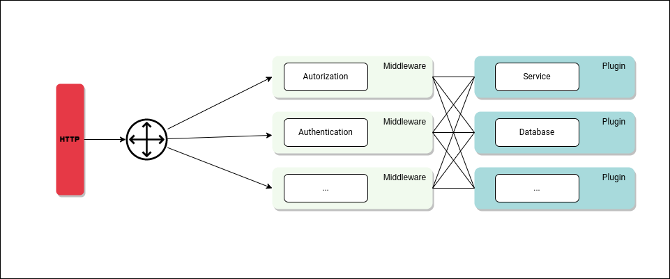

<br>
<br>

Doorkeeper is a modular, developer-friendly API Gateway written in Go.

**doorkeeper-core** comes with the essential code of the solution, which you can extend it with your own code or making use of third-party add-ons

## Architecture



## Add-ons

### Plugins

- **doorkeeper-psql-mapper** -> a plugin that scaffolds _PostgreSQL_ schemas and binds tables to API paths
- **doorkeeper-mysql-mapper** -> a plugin that scaffolds _MySQL_ schemas and binds tables to API paths
- **doorkeeper-sqlite-mapper** -> a plugin that scaffolds _Sqlite3_ databases and binds tables to API paths

### Middlewares

- **doorkeeper-rate-limiter** -> a middleware to implement different rate limiting approaches (token bucket, fixed window, etc)
- **doorkeeper-parameter-validator** -> a middleware to verify if parameters sent by users is correct, eliminating posterior validation 
- **doorkeeper-aaa** -> a middleware to provide Accounting, Authentication and Authorization to endpoints

## Getting started

The following steps will guide you through the configuration of doorkeeper with a custom middleware and plugin

First pulls source code from GitHub:

```bash
go get github.com/ojalmeida/doorkeeper-core
```

Then uses in your code:

- main.go
```go

package main

import (
	core "github.com/ojalmeida/doorkeeper-core"
	"os"
)

func main() {

	configFile, err := os.Open("/tmp/doorkeeper.conf")

	if err != nil {
		panic("unable to open configuration file : " + err.Error())
	}
	
	core.SetConfigFile(configFile)
	core.BindPlugin("^/my_endpoint", &myPlugin{})
	core.BindMiddleware("^/my_endpoint", &myMiddleware{})
	core.Start() // blocks execution

}
```

- structs.go

Notice that myPlugin and myMiddleware must implement Plugin and Middleware interfaces, respectively:

```go

package main

import (
	"log"
	"net/http"
)

type myPlugin struct{}

func (myPlugin) Handle(r *http.Request, w http.ResponseWriter) error {
	
	_, err := w.Write([]byte("Request handled by custom plugin"))
	
	return err
}

func (myPlugin) SetInfoLogger(logger *log.Logger) {

	// implement if you want to be able to log custom parameters
}

func (myPlugin) SetWarnLogger(logger *log.Logger) {

	// implement if you want to be able to log custom parameters
	
}

func (myPlugin) SetErrorLogger(logger *log.Logger) {

	// implement if you want to be able to log custom parameters
	
}

func (myPlugin) Name() string {
	
	return "myPlugin"
}

type myMiddleware struct{}

func (myMiddleware) Handle(r *http.Request, w http.ResponseWriter) (bool, error) {

	
	// true means that the request can keep following through 
	// the middleware pipeline, a.k.a. "everything ok"
	return true, nil
	
}

func (myMiddleware) SetInfoLogger(logger *log.Logger) {
	
	// implement if you want to be able to log custom parameters
}

func (myMiddleware) SetWarnLogger(logger *log.Logger) {

	// implement if you want to be able to log custom parameters
	
}

func (myMiddleware) SetErrorLogger(logger *log.Logger) {

	// implement if you want to be able to log custom parameters
	
}

func (myMiddleware) Name() string {

	return "myMiddleware"
	
}
```

With this done you should be able to receive different responses depending on which endpoint the requests are being made

```bash

curl 'http://127.0.0.1:8080/nothing_here' # empty 200-OK response
curl 'http://127.0.0.1:8080/my_endpoint' # "Request handled by custom plugin"

```